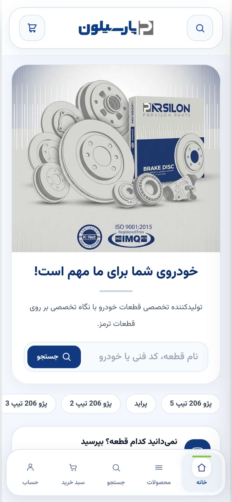
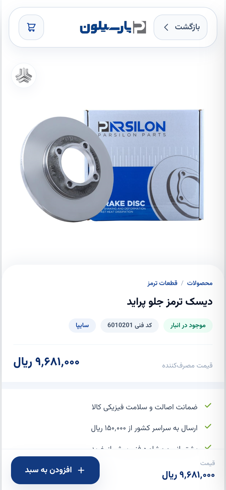

# Parsilon Part

Mobile-first online shop for Parsilon auto parts (brake discs, brake drums,
wheel bearings, brake cylinders and pulleys), with an admin panel.

**Created by Arman Naseri Far.**

## Screenshots

| Home | Products | Product page | AI assistant |
| --- | --- | --- | --- |
|  |  |  |  |

## Features

**Shop**

- Home page with product lines, brands, categories and featured products
- Product list with search, filters (category, car brand, in stock) and sorting
- Product pages with specifications, compatible cars and related parts
- Live search, cart, checkout and order tracking
- Wholesale request form
- Installable on a phone's home screen (PWA)

**AI parts assistant** (`/assistant`)

- A chat agent that finds the right part for a customer's car
- Built on the Claude API with tool use: it searches the live catalogue,
  checks price and stock, and shows the matching parts as cards
- It reads the catalogue only; it cannot place orders or see accounts

**Admin panel**

- Products, brands and categories
- Orders and order status
- Wholesale requests
- Sales reports

## Tech stack

Next.js 15 (App Router), React 19, TypeScript, Prisma 7, PostgreSQL,
Tailwind CSS, Anthropic SDK (Claude) for the assistant.

## Getting started

You need Node.js 22 and a PostgreSQL database.

```bash
cp .env.example .env        # then fill in DATABASE_URL and JWT_SECRET
npm install
npm run db:migrate          # apply database migrations
npm run dev                 # http://localhost:3000
```

`JWT_SECRET` must be at least 32 random characters. Generate one with
`openssl rand -base64 48`. The app refuses to create sessions with a missing
or weak secret.

The assistant needs `ANTHROPIC_API_KEY` in `.env`. Without it, the assistant
page says it is not set up and the rest of the shop works normally.

To load demo data (never in production):

```bash
SEED_PASSWORD='choose-a-password' npm run db:seed
```

## Scripts

| Command | What it does |
| --- | --- |
| `npm run dev` | Development server |
| `npm run build` / `npm start` | Production build and server |
| `npm run typecheck` | TypeScript check |
| `npm run lint` | ESLint |
| `npm run db:migrate` | Apply database migrations |
| `npm run db:seed` | Load demo data |
| `npm run db:studio` | Prisma Studio |

## Project structure

| Path | Contents |
| --- | --- |
| `app/` | Pages and API routes |
| `app/admin/` | Admin panel |
| `app/api/` | Backend endpoints |
| `components/` | Shared UI components |
| `context/` | Auth, cart and order state |
| `lib/` | Pricing, sessions, validation and data access |
| `lib/assistant/` | The assistant's tools and system prompt |
| `prisma/` | Database schema, migrations and seed scripts |
| `public/images/` | Product photos and brand assets |

## How orders stay correct

- The order API accepts only product identity and quantity. Names, prices,
  shipping, VAT and totals are computed on the server from the database
  (`lib/pricing.ts`, `app/api/orders/route.ts`).
- Stock is decremented with a conditional update inside the order
  transaction, and the database enforces `stock >= 0`, so concurrent orders
  cannot oversell.
- Cancelling an order in the admin panel returns its stock exactly once.

## Security

- Passwords are hashed with bcrypt; sessions are signed, HTTP-only cookies.
- Login, sign-up, ordering and the wholesale form are rate limited.
- Every admin endpoint checks the user's role against the database.

## Not built yet

- Online payment gateway: orders are created as "pending review".
- Rate limiting is kept in process memory (`lib/rate-limit.ts`); use Redis
  when running more than one server instance.
- Automated tests.

## Author

Created by **Arman Naseri Far**.
